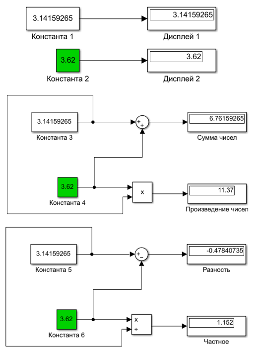
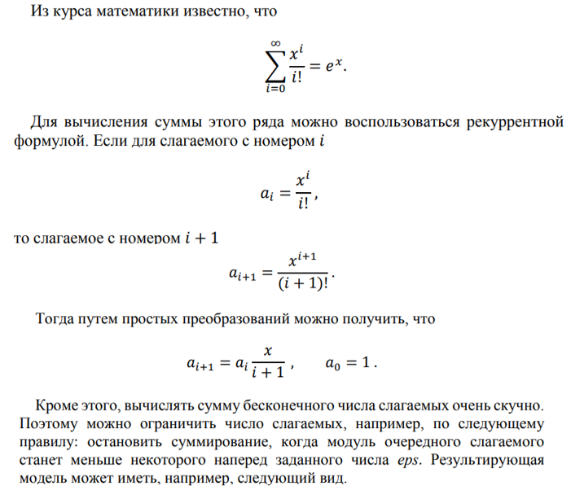
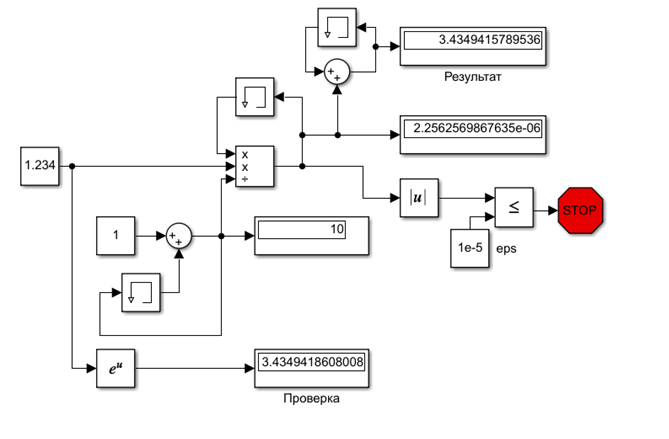
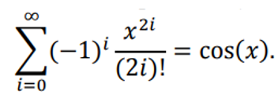
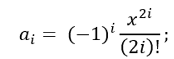
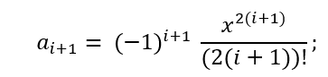
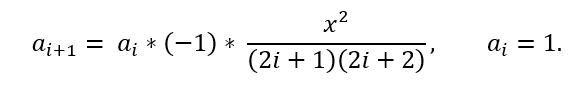
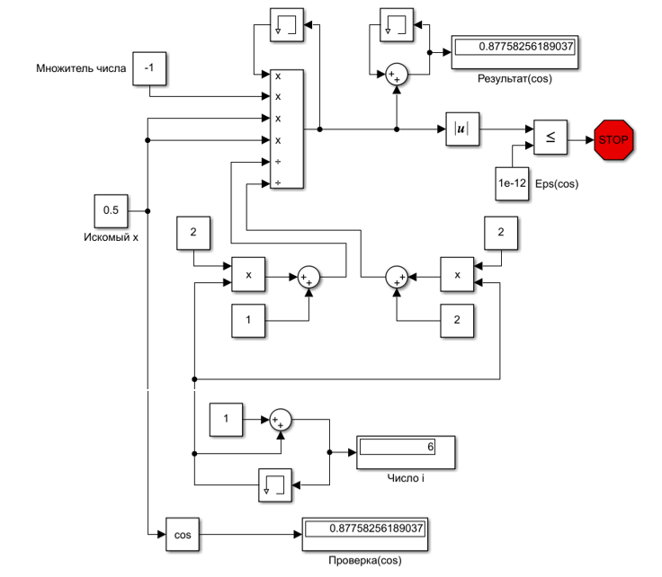

				Министерство образования Республики Беларусь
		Учреждение образования «Брестский государственный технический университет»
						Кафедра ИИТ

					Лабораторная работа № 1
					По дисциплине: «ММИПиУ»
						За 5 семестр
					Тема: «Знакомство с Simulink»

										Выполнил:
										студент 3-го курса
										группы АС-56
										Гузаревич А.Н.

										Проверил:
										Пролиско Е. Е.

						Брест 2021
Цель: 1) освоить основные операции используемые при построении модели Simulink (перенос блоков, соединение, настройка параметров, запуск); 
2) построить модель вычислительного процесса на примере оценки суммы ряда.
Задание 1. Выполним простейшие построения различных элементов, используя блоки: Constant, Display, Sum, Product. Научиться их соединять.
Выполним, сверяясь с методологическими указаниями.
 

Задание 2. Реализовать функцию ex, используя средства Simulink. 

1)Блоки Memory сохраняют результат выполнения операции до следующей итерации моделирования. Имеют своё начальное значение, которое необходимо установить, в соответствии с условием задачи.
У блока Memory, который используется для итерирования(i) имеет начальное значение равное 0.
Блок Memory, расположенный над блоком произведения, сохраняет результат выполнения операции, которые будут использованы в дальнейшем. Т.к. он участвует в произведении, начальное значение зададим равное 1.
Последний блок Memory, расположенный около блока результата, сохраняет результат суммирования результатов в ряду. Значение устанавливаем равное 1, т.к. при сложении суммы ряда a0 = 1, тогда начальное значение будет 1, к которому будут прибавляться остальные значения ai.
2)Блок Display, расположенный над Проверкой, показывает значение i, которое отвечает за номер шага итерации.
Блок Display, расположенный под Результатом, показывает значение ai на i-том шаге итерирования.
Задание 3. Предложите модель Simulink для расчета суммы ряда:
 

Выполним аналогичные преобразования для cos из задания 2. 
Для вычисления суммы этого ряда можно воспользоваться рекуррентной формулой. Если для слагаемого с номером i:

то слагаемое с номером i+1:

Используя простые преобразования, можно получить

Остановим суммирование, когда модуль очередного слагаемого станет меньше некоторого наперед заданного числа eps. 
Результирующая модель может иметь, например, следующий вид. 

Вывод: мы изучили основные операции используемые при построении модели Simulink (перенос блоков, соединение, настройка параметров, запуск); исследовали поведение некоторых блоков при нескольких шагах итерирования; построили модель вычислительного процесса на примере оценки суммы ряда. 
