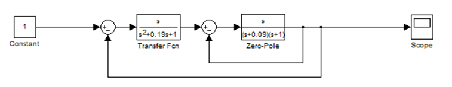
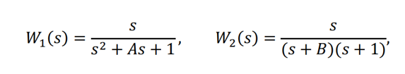
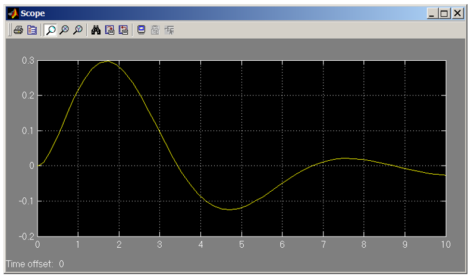
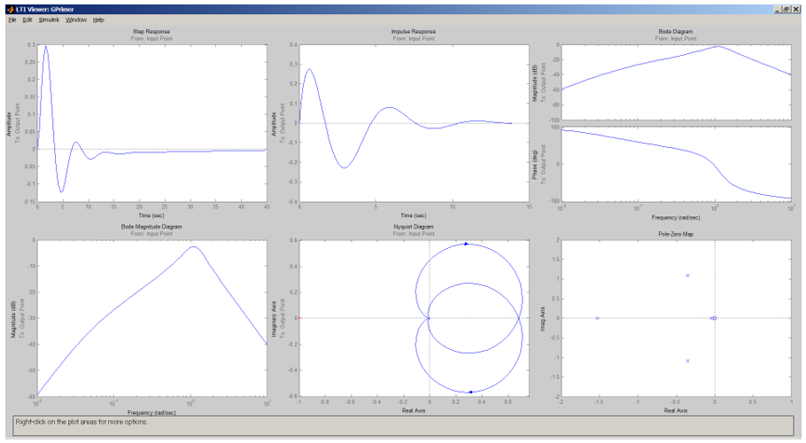

				Министерство образования Республики Беларусь
		Учреждение образования «Брестский государственный технический университет»
						Кафедра ИИТ

					Лабораторная работа № 3
		По дисциплине: «Математические модели информационных процессов и управления»
						За 5 семестр
			Тема: «Подключение основных настроек LTI-viewer»

										Выполнил:
										студент 3-го курса
										группы АС-56
										Гузаревич А.Н.

										Проверил:
										Пролиско Е. Е.

						Брест 2021 

Цель: научиться строить в Simulink модель системы с использование LTI-viewer. 

Задание 1. Подключим LTI-viewer к нашей системе. 
Выполним структурную схему, сверяясь с методологическими указаниями.

 

Передаточные функции блоков:

где А = номер дня рождения / 100; В = номер месяца рождения / 100 .
На осциллографе (Scope) получим переходную функцию системы:

Задание 2: Получим основные характеристики системы (передаточную функцию, 
импульсную характеристику, амплитудно-частотную и фазо-частотные 
характеристики, диаграмму Найквиста, значение нулей и полюсов);

Вывод: мы научились строить в Simulink модель системы с сложной структурой с использованием LTI-viewer.

