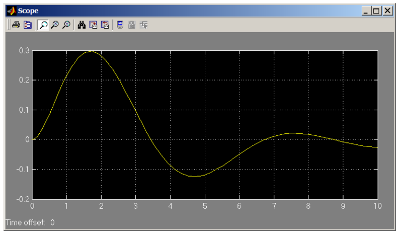

				Министерство образования Республики Беларусь
		Учреждение образования «Брестский государственный технический университет»
						Кафедра ИИТ

					Лабораторная работа № 4
		По дисциплине: «Математические модели информационных процессов и управления»
						За 5 семестр
				Тема: «Эквивалентные передаточные функции»

											Выполнили:
											студенты 3-го курса
											группы АС-56
											Гузаревич А.Н.
											Хевук Д.А.

											Проверил:
											Пролиско Е. Е.

						Брест 2021 
Цель: научиться строить в Simulink модель системы с сложной структурой с обратными связями и 
эквивалентную ей передаточную функцию.
Задание 1. Выполним структурную схему, сверяясь с методологическими указаниями.
 
Передаточные функции блоков:
 
где А = номер дня рождения / 100; В = номер месяца рождения / 100 .
На осциллографе (Scope) получим переходную функцию системы:
 

Задание 2: получим блок с передаточной функцией эквивалентной передаточной функции исходной системы;

Задание 3: покажем, что все характеристики и показатели сохраняются.
Отличия структурных схем:
 

Отличие осциллографа переходной функции системы:
 
 

Отличие основных характеристик системы:
 
 

Все характериcnbrb и показатели практически совпадают.
Вывод: мы научились строить в Simulink модель системы с сложной структурой с обратными связями и эквивалентную ей передаточную функцию.
