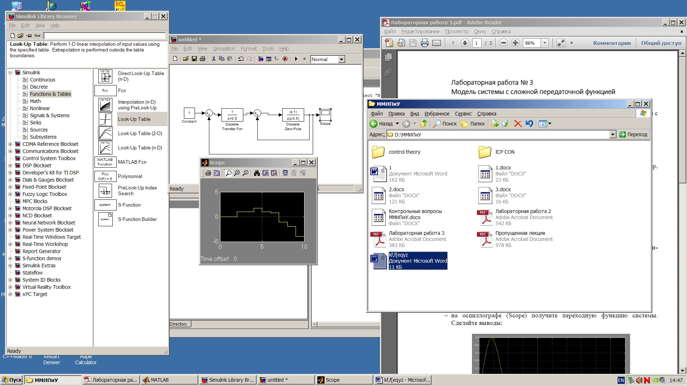

             
              Министерство образования Республики Беларусь
                          Учреждение образования 
            «Брестский государственный технический университет»
                            Кафедра ИИТ

                           Лабораторная работа №2 
                     Построение модели системы в Simulink

	                                	Выполнила:
                                                студентка 3 курса
                                                группы АС-56
                                                Карпенко М.В.

                                                Проверил:
                                                Иванюк Д.С.

                                 Брест 2021

Цель: научиться строить в Simulink модель системы с сложной структурой с 
обратными связями.

                         Ход работы:

1.Построить модель системы.

2. Получить переходную функцию системы.

Вывод: научилась строить в Simulink модель системы с сложной структурой с обратными связями.
