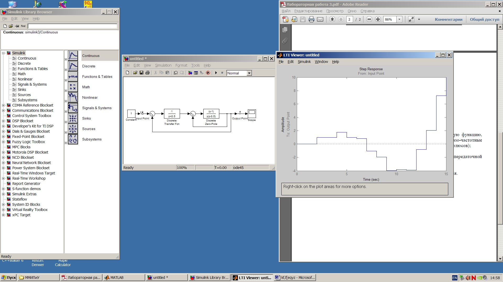

             
              Министерство образования Республики Беларусь
                          Учреждение образования 
            «Брестский государственный технический университет»
                            Кафедра ИИТ

                           Лабораторная работа №3 
                           Знакомство с LTI-viewer

	                                	Выполнила:
                                                студентка 3 курса
                                                группы АС-56
                                                Карпенко М.В.

                                                Проверил:
                                                Иванюк Д.С.

                                 Брест 2021

Цель: Освоить использование LTI-viewer.

                                 Ход работы:
1.Подключить LTI-viewer.

2.Получить переходную характеристику системы.

Вывод: освоила использование LTI-viewer.
