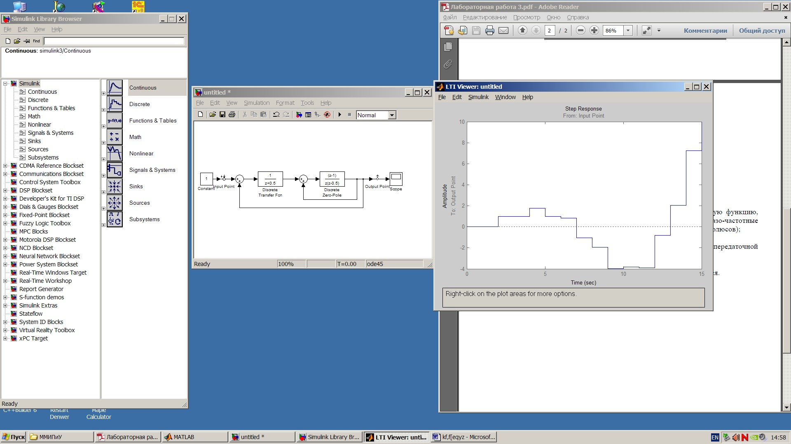
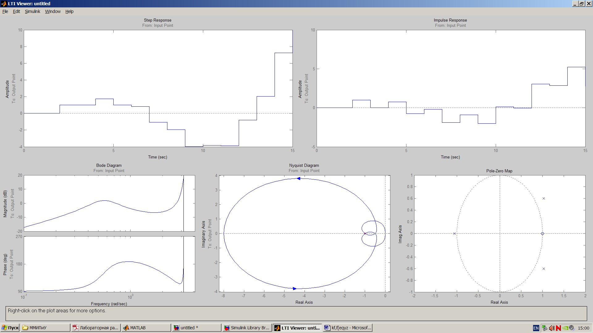
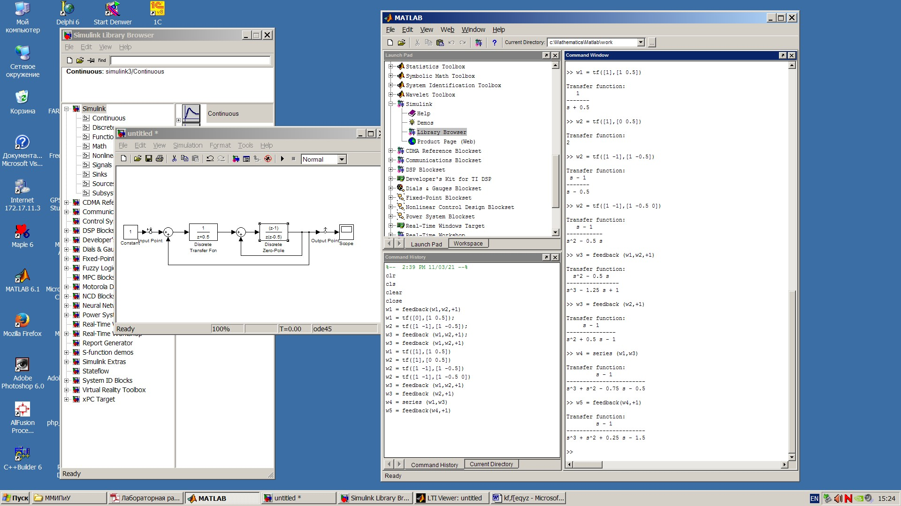
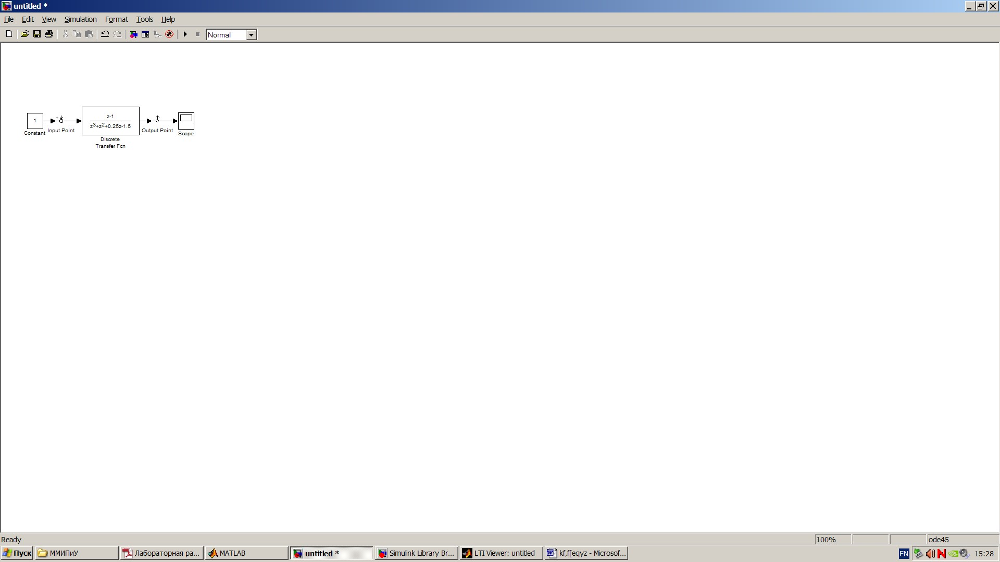

             
              Министерство образования Республики Беларусь
                          Учреждение образования 
            «Брестский государственный технический университет»
                            Кафедра ИИТ

                           Лабораторная работа №4 
                 Модель системы с сложной передаточной функцией

	                                	Выполнила:
                                                студентка 3 курса
                                                группы АС-56
                                                Карпенко М.В.

                                                Проверил:
                                                Иванюк Д.С.

                                 Брест 2021

Цель: получить блок с передаточной функцией эквивалентной передаточной функции исходной системы и проверить соответствие характеристик. 

                                 Ход работы:

1.Получить основные характеристики системы:
                       переходная функция

                   импульсная характеристика      

         амплитудно-частотная и фазо-частотная характеристика

                       диаграмма Найквиста

                    значения нулей и полюсов

2.Получить блок с передаточной функцией эквивалентной передаточной ыункции исходной системы

3.Характеристики эквивалентной системы:
                      переходная функция

                   импульсная характеристика      

         амплитудно-частотная и фазо-частотная характеристика

                       диаграмма Найквиста

                    значения нулей и полюсов

Вывод: получила блок с передаточной функцией эквивалентной передаточной функции исходной системы и проверила соответствие характеристик. 
