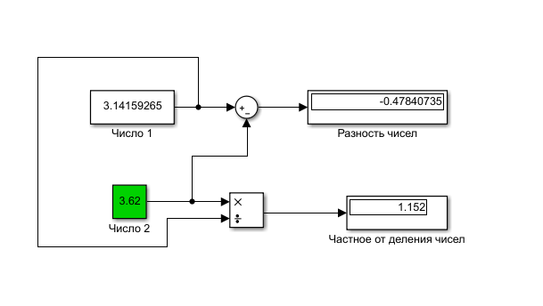
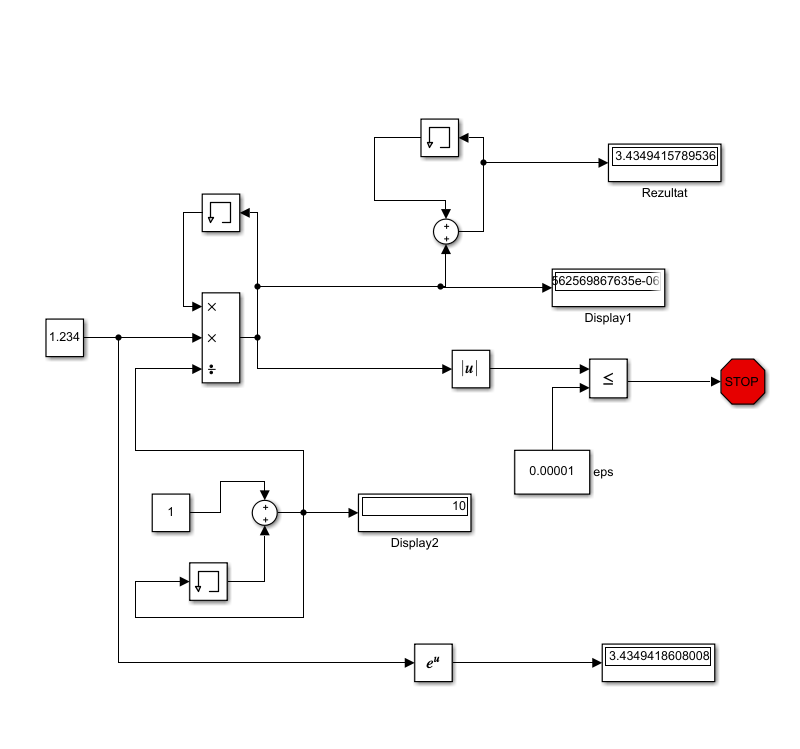
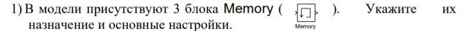
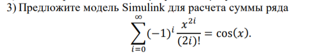
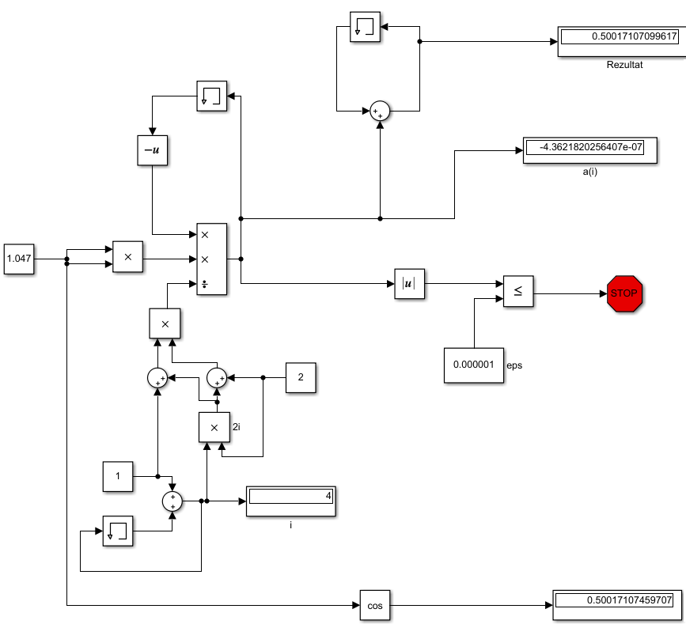

# Laboratory work No.1              
              MINISTRY OF EDUCATION OF THE REPUBLIC OF BELARUS
                          EDUCATIONAL INSTITUTION 
                    «BREST STATE TECHNICAL UNIVERSITY»        
                            Department of IIT

                           Laboratory work No.1 
                           Знакомство с Simulink

	                                	Completed by the 3rd year student of 
                                                Faculty of Electronic Information Systems
	                                	the group AC-56 Orekhva N.A.
                                 		Checked by Ivanuk D.S.

                                 Brest 2021

Пример 1:

Пример 2:

Блок memory используется для хранения предыдущей переменной для расчета по формуле 

Вывод: освоил основные оперции используемые при построении модели Simulink, а так же построил модель для определенного случая. 
