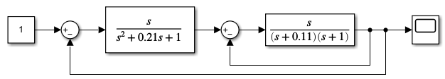
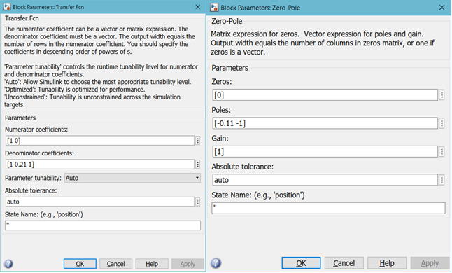
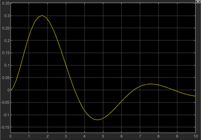
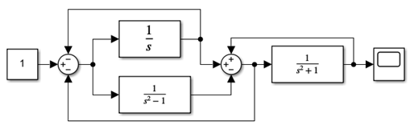
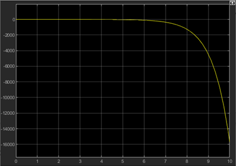

						Министерство образования Республики Беларусь
							Учреждение Образования
						«Брестский Государственный Технический Университет»
									Кафедра ИИТ

							Лабораторная работа №2
						По дисциплине ММИПиУ за V семестр
						Тема: «Модель системы с сложной передаточной функцией»

													Выполнил:
												Студент 3-го курса
												Группы АС-56
												Соротокин С.В.
												Проверил:
												Пролиско Е.Е.

									Брест 2021
Цель работы: научиться строить в Simulink модель системы с сложной структурой с обратными связями; освоить использование LTI-viewer.
Ход работы
Задание
– запустите Matlab и в нем Simulink;
– откройте новое окно модели и постройте модель системы.

 
Параметры блоков Transfer Fcn и Zero-Pole:
  

– на осциллографе (Scope) получите переходную функцию системы.
 
 
 
Построим дополнительно следующую модель системы:
 
 
 
На осциллографе получим следующий график:

 
Вывод: я научился строить в Simulink модель системы с сложной структурой с обратными связями; освоил использование LTI-viewer.
