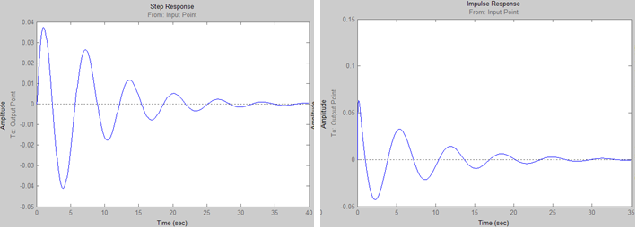
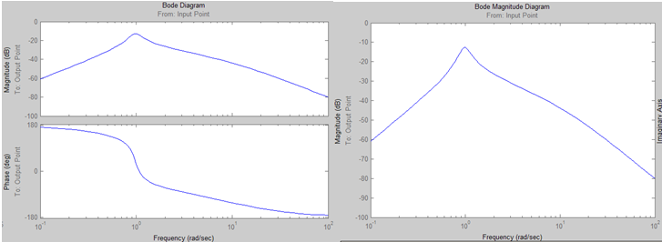
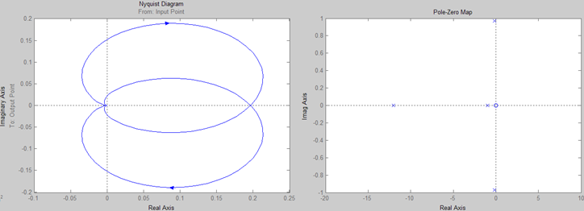

						Министерство образования Республики Беларусь
							Учреждение Образования
						«Брестский Государственный Технический Университет»
									Кафедра ИИТ

							Лабораторная работа №3
						По дисциплине ММИПиУ за V семестр
						Тема: «Модель системы с сложной передаточной функцией»

													Выполнил:
												Студент 3-го курса
												Группы АС-56
												Соротокин С.В.
												Проверил:
												Пролиско Е.Е.

									Брест 2021
Цель работы: освоить использование LTI-viewer.
Ход работы
Задание
– запустите Matlab и в нем Simulink;
– откройте новое окно модели и постройте модель системы.
– подключите LTI-viewer к вашей системе.

 
– получите основные характеристики системы (передаточную функцию, импульсную характеристику, амплитудно-частотную и фазо-частотные характеристики, диаграмму Найквиста, значение нулей и полюсов);
Step – показывает реакцию на единичное ступенчатое воздействие.
Impulse – показывает реакцию на импульсное ступенчатое воздействие.

Bode – показывает логарифмическую амплитудную и фазовую частотные характеристики.
Bode magnitude – показывает логарифмическую амплитудную частотную характеристику.
  
 
  
Nyquist – показывает Диаграмму Найквиста (она представляет собой график частотной характеристики разомкнутой системы с передаточной функцией G, построенной в полярных координатах).
Pole-Zero – показывает нули и полюса системы.
 
 
 

Вывод: освоил использование LTI-viewer.
