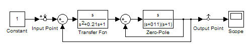
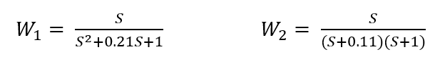
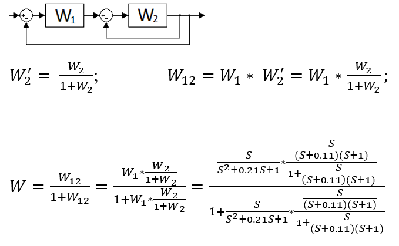
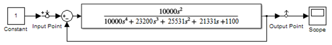
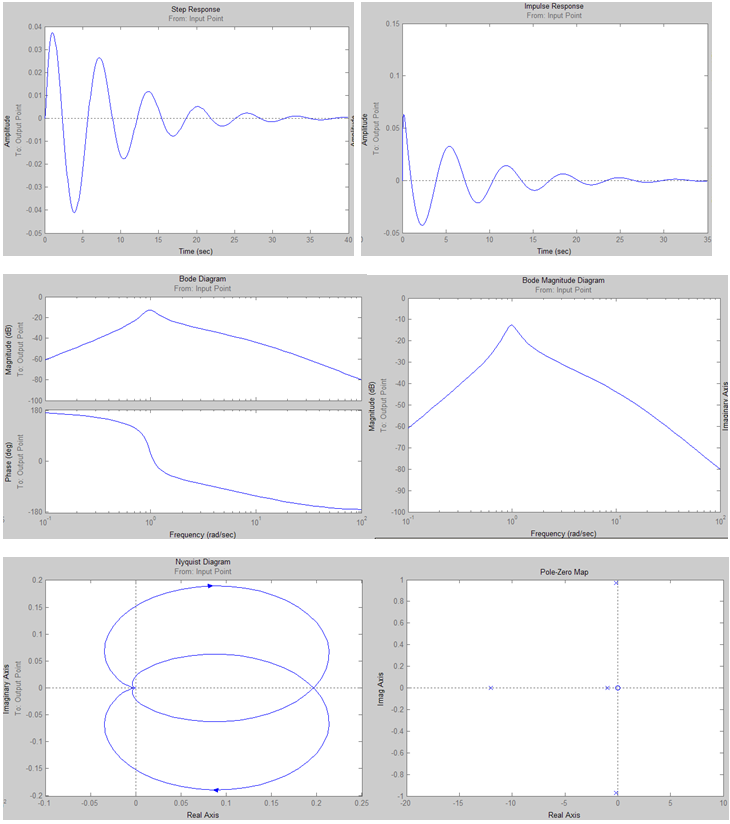
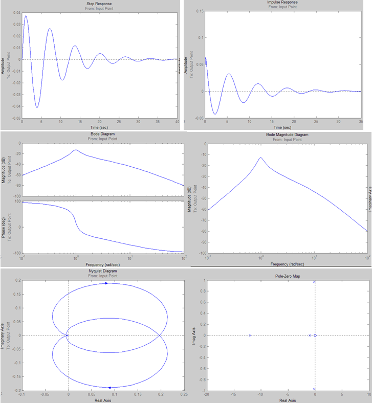

						Министерство образования Республики Беларусь
							Учреждение Образования
						«Брестский Государственный Технический Университет»
									Кафедра ИИТ

							Лабораторная работа №4
						По дисциплине ММИПиУ за V семестр
						Тема: «Преобразование системы с сложной передаточной функцией»

													Выполнил:
												Студент 3-го курса
												Группы АС-56
												Соротокин С.В.
												Проверил:
												Пролиско Е.Е.

									Брест 2021
Цель работы: научиться преобразовывать системы с сложными передаточными функциями.
Ход работы
Задание
– запустите Matlab и в нем Simulink;
– откройте новое окно модели и постройте модель системы.
 

 
Получим блок с передаточной функцией эквивалентной передаточной функции исходной системы (расчет эквивалентной функции проводится вручную):

Произведем вычисления:
 

Подсчитаем и получим:
 

 
Характеристики преобразованной передаточной функции:
    

 
Характеристики исходной функции (для сравнения):
    

  
 
При сравнении характеристик преобразованной передаточной функции с характеристиками исходной (полученными в результате 3 лабораторной работы), можем сделать вывод об их идентичности. Следовательно, преобразования сделаны правильно.
Вывод: я научился преобразовывать системы с сложными передаточными функциями.
