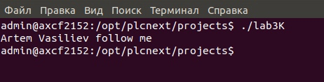

                                     МИНИСТЕРСТВО ОБРАЗОВАНИЯ РЕСПУБЛИКИ БЕЛАРУСЬ
                                                УЧРЕЖДЕНИЕ ОБРАЗОВАНИЯ 
                                  «БРЕСТСКИЙ ГОСУДАРСТВЕННЫЙ ТЕХНИЧЕСКИЙ УНИВЕРСИТЕТ»
                                                    КАФЕДРА ИИТ


                                                Лабораторная работа №3
                                            "Работа с контроллером AXC F 2152"


                                                                                Выполнил:
                                                                                студент 3 курса
                                                                                группы АС-55
                                                                                Васильев А.С.

                                                                                Проверил:
                                                                                Иванюк Д. С.


                                                  Брест, 2021  


```Работа с контроллером AXC F 2152```
```1.Изучить руководство и согласно ему подготовить образ Ubuntu 18.04 LTS.```
```2.В среде Eclipse создать тестовый проект "Hello world!", собрать его и продемонстрировать работоспособность на тестовом контроллере.```
```Код программы:```
```    
//============================================================================
// Name        : lab3.cpp
// Author      : Vasiliev Artem
// Version     :
// Copyright   : 
// Description : Hello World in C++, Ansi-style
//============================================================================

#include <iostream>
using namespace std;

int main() {
	cout << "Hello World!" << endl; // вывод "Hello World!"
	return 0;
}


```
                        
