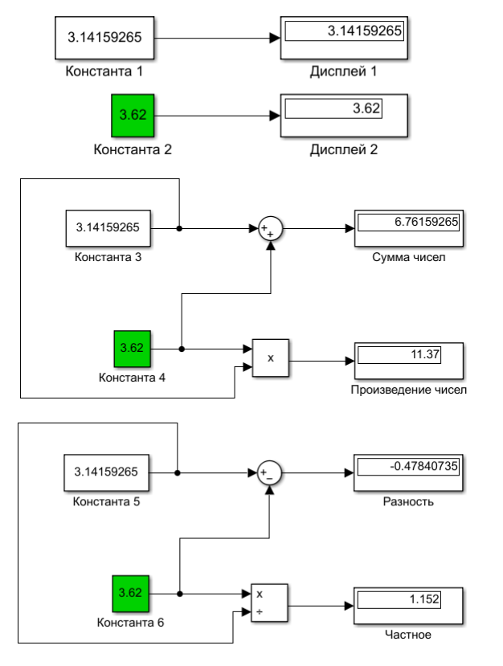

                                  МИНИСТЕРСТВО ОБРАЗОВАНИЯ РЕСПУБЛИКИ БЕЛАРУСЬ
                                            УЧРЕЖДЕНИЕ ОБРАЗОВАНИЯ 
                              «БРЕСТСКИЙ ГОСУДАРСТВЕННЫЙ ТЕХНИЧЕСКИЙ УНИВЕРСИТЕТ»
                                                КАФЕДРА ИИТ


                                            Лабораторная работа №1
           По дисциплине: «Математические модели информационных процессов и управления»
                                              За 5 семестр
                                        Тема: «Знакомство с Simulink»


                                                                            Выполнила:
                                                                            студентка 3-го курса
                                                                            группы АС-55
                                                                            Казак А. А.

                                                                            Проверил:
                                                                            Пролиско Е. Е.


                                              Брест 2021

```

Цель: 1) освоить основные операции используемые при построении модели Simulink (перенос блоков, соединение, настройка параметров, запуск); 
      2) построить модель вычислительного процесса на примере оценки суммы ряда.
Задание 1. Выполним простейшие построения различных элементов, используя блоки: Constant, Display, Sum, Product. Научиться их соединять.

Выполним, сверяясь с методологическими указаниями.

<p align="center">

</p>