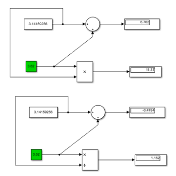
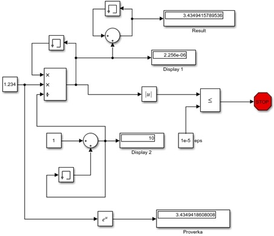
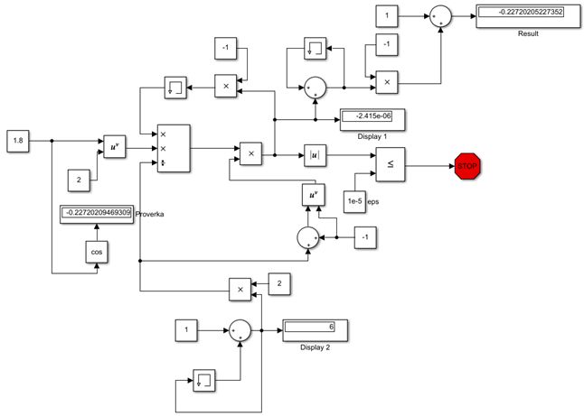

						Министерство образования Республики Беларусь
							Учреждение Образования
			   		     «Брестский Государственный Технический Университет»
					    		    Кафедра ИИТ

							Лабораторная работа №1
						По дисциплине ММИПиУ за V семестр
						Тема: «Знакомство с Simulink»

													Выполнил:
												Студент 3-го курса
												Группы АС-56
												Волк Н.А.
												Проверил:
												Пролиско Е.Е.

								Брест 2021

Цель работы: освоить основные операции используемые при построении модели Simulink (перенос блоков, соединение, настройка параметров, запуск); построить модель вычислительного процесса на примере оценки суммы ряда.
Ход работы
Задание
Содержание файла Modelka_1.mdl:

Содержание файла Modelka_2.mdl (вычисление суммы ряда ∑((x^i)/i!) = exp(x)):

 
1)Блок Memory содержит и задерживает свой вход одним главным временным шагом интегрирования. В данной модели для двух верхних блоков Memory, установлены следующие настройки: Initial condition:1; для нижнего блока Memory установлены настройки: Initial condition:0. 
2)Display 1 отображает значение ai =   текущей итерации. Display 2 отображает номер текущей итерации.
3)Создадим модель Simulink для расчета суммы ряда ∑(((-1)^i)*(x^2i)/(2i)!) = cos(x):

Вывод: я освоил основные операции используемые при построении модели Simulink (перенос блоков, соединение, настройка параметров, запуск); построил модель вычислительного процесса на примере оценки суммы ряда.