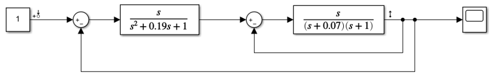
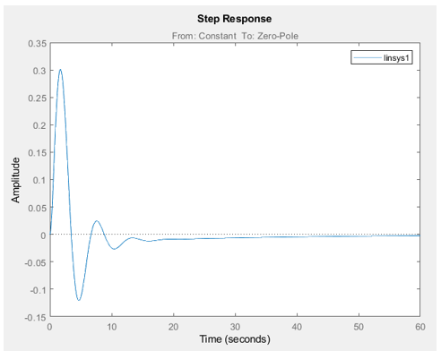
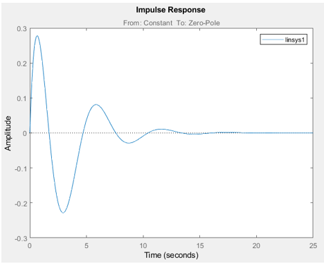
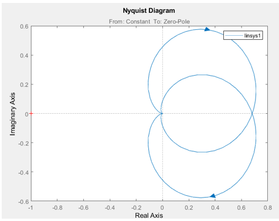
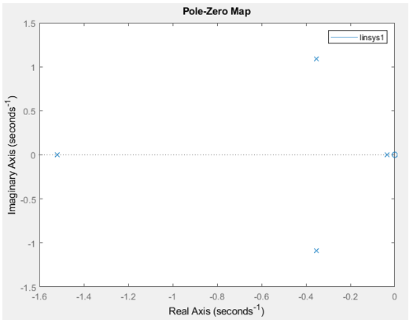

						Министерство образования Республики Беларусь
							Учреждение Образования
			   		     «Брестский Государственный Технический Университет»
					    		    Кафедра ИИТ

							Лабораторная работа №3
						По дисциплине ММИПиУ за V семестр
						Тема: «LTI-viewer»

													Выполнил:
												Студент 3-го курса
												Группы АС-56
												Волк Н.А.
												Проверил:
												Пролиско Е.Е.

								Брест 2021

Цель работы: освоить использование LTI-viewer.
Ход работы
Задание
– запустите Matlab и в нем Simulink;
– откройте новое окно модели и постройте модель системы.

Параметры блоков Transfer Fcn и Zero-Pole:

 
– на осциллографе (Scope) получим переходную функцию системы:

Подключим LTI-viewer к нашей системе:

При этом окно LTI-viewer будет иметь следующий вид:

Получим основные характеристики системы:
Передаточная функция:

Фазо-частотная и амплитудно-частотная характеристика:

Импульсная характеристика:

Диаграмма Найквиста:

Значение нулей и полюсов:

Вывод: я освоил использование LTI-viewer.