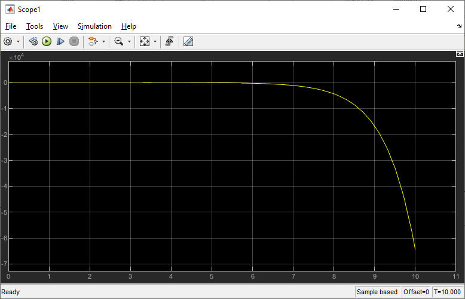
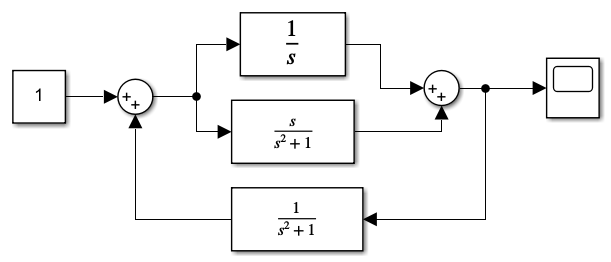

				
                                  МИНИСТЕРСТВО ОБРАЗОВАНИЯ РЕСПУБЛИКИ БЕЛАРУСЬ
                                            УЧРЕЖДЕНИЕ ОБРАЗОВАНИЯ 
                              «БРЕСТСКИЙ ГОСУДАРСТВЕННЫЙ ТЕХНИЧЕСКИЙ УНИВЕРСИТЕТ»
                                                КАФЕДРА ИИТ

                                            Лабораторная работа № 2
           По дисциплине: «Математические модели информационных процессов и управления»
                                              За 5 семестр
                             Тема: «Модель системы с сложной передаточной функцией»

                                                                            Выполнил:
                                                                            студент 3-го курса
                                                                            группы АС-56
                                                                            Железко В. Д.

                                                                            Проверил:
                                                                            Пролиско Е. Е.

                                              Брест 2021

	Цель: 
		1) освоить основные структуры, используемые при построении модели Simulink 
		(перенос блоков, соединение, настройка параметров, запуск); 
		2) построить сложную модель вычислительного процесса, с использованием обратных сязей.
		3) ознакомиться с результатами моделирования.

	Ход работы:

	Выполнить построение модели(1) системы, используя передаточную 
функцию (Transfer Fcn) и функцию нули-полюса (Zero-Pole)
Выполним, сверяясь с методологическими указаниями.
Схема приведённой модели:

Передаточные функции блоков:

где А = номер дня рождения / 100; В = номер месяца рождения / 100.

На осциллографе (Scope) получим переходную функцию системы:

	Построим дополнительную модель(2).
Схема исследуемой модели:

Передаточные функции блоков:

На осциллографе (Scope) получим переходную функцию системы:

	Построим дополнительную модель(3).
Схема исследуемой модели:

Передаточные функции блоков:

На осциллографе (Scope) получим переходную функцию системы:

	Вывод:
Мы изучили основные операции используемые при построении сложных моделей Simulink; 
исследовали поведение некоторых блоков при добавлении в схему обратных связей; 
построили сложные модели и исследовали полученные результаты.
