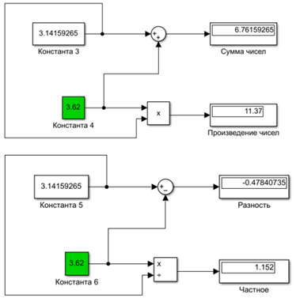
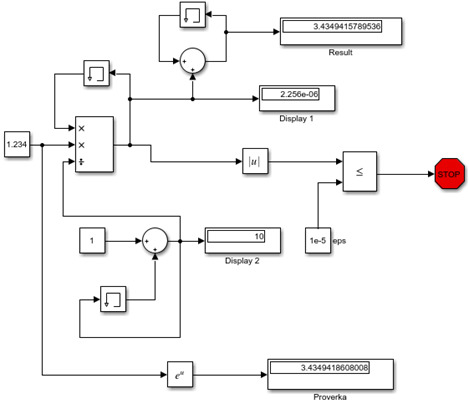
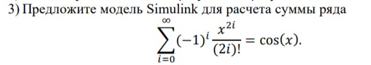
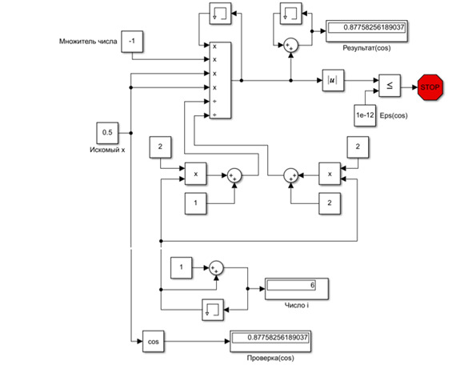

             
              Министерство образования Республики Беларусь
                          Учреждение образования 
            «Брестский государственный технический университет»
                            Кафедра ИИТ

                           Лабораторная работа №1 
                           Знакомство с Simulink

	                                	Выполнил:
                                                студент 3 курса
                                                группы АС-56
                                                Мартынюк Р.С.

                                                Проверил:
                                                Иванюк Д.С.

                                 Брест 2021

Цель: освоить основные операции, используемые при построении модели Simulink (перенос блоков, соединение, настройка параметров, запуск), построить модель вычислительного процесса на примере оценки суммы ряда.

Ход работы
Задание 1. Выполним простейшие построения различных элементов. 

 Задание 2. Реализовать функцию ex, используя средства Simulink:

1)Блок Memory содержит и задерживает свой вход одним главным временным шагом интегрирования. В данной модели для двух верхних блоков Memory, установлены следующие настройки: Initial condition:1; для нижнего блока Memory установлены настройки: Initial condition:0. 
2)Display 1 отображает ai = x_i/i! (значение слагаемого с номером i). Display 2 отображает i (номер итерации). 

   
                   :

Вывод: я освоил основные операции используемые при построении модели Simulink (перенос блоков, соединение, настройка параметров, запуск); построил модель вычислительного процесса на примере оценки суммы ряда.
 
