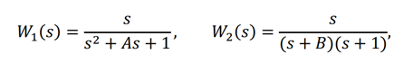
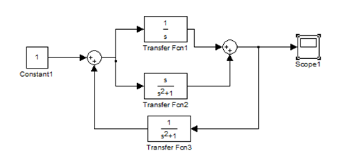
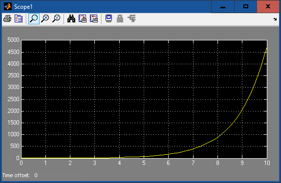

						Министерство образования Республики Беларусь
							Учреждение Образования
			   		     «Брестский Государственный Технический Университет»
					    		    Кафедра ИИТ

							Лабораторная работа №2
						По дисциплине ММИПиУ за V семестр
						Тема: «Модель системы с сложной передаточной функцией»

													Выполнил:
												Студент 3-го курса
												Группы АС-56
												Мартынюк Р.С.
												Проверил:
												Пролиско Е.Е.

								Брест 2021

Цель:  научиться строить в Simulink модель системы с сложной структурой обратными связями. 
Задание 1. Выполнить построение модели системы, используя передаточную функцию (Transfer Fcn) и функцию нули-полюса (Zero-Pole)
Выполним, сверяясь с методологическими указаниями.

 
Передаточные функции блоков:

 
где А = номер дня рождения / 100; В = номер месяца рождения / 100 .
На осциллографе (Scope) получим переходную функцию системы:

  
Построим дополнительную модель 1:

 
Передаточная функция блоков: 
W1 = 1/s , W2 = 1 / (s2 + 1) ,  W3 = 1 / (s2 + 1) .
На осциллографе получим переходную функцию системы:

 
Вывод: я научилися строить в Simulink модель системы с сложной структурой с обратными связями.
