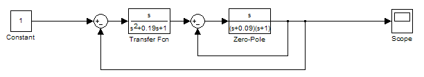
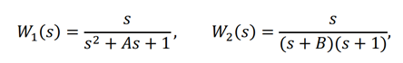
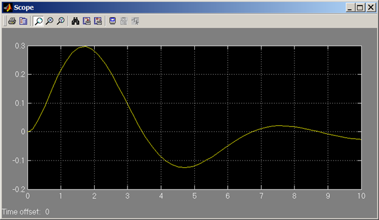
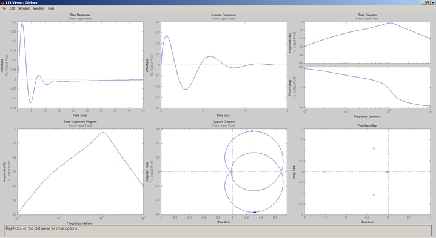

             
              Министерство образования Республики Беларусь
                          Учреждение образования 
            «Брестский государственный технический университет»
                            Кафедра ИИТ

                           Лабораторная работа №3 
                «Модель системы с сложной передаточной функцией»

	                                	Выполнил:
                                                студент 3 курса
                                                группы АС-56
                                                Мартынюк Р.С.

                                                Проверил:
                                                Пролиско Е.Е.

                                 Брест 2021

Цель: научиться строить в Simulink модель системы с использование LTI-viewer. 
Задание 1. Подключим LTI-viewer к нашей системе. 
Выполним структурную схему, сверяясь с методологическими указаниями.
 

Передаточные функции блоков:

 
где А = номер дня рождения / 100; В = номер месяца рождения / 100 .
На осциллографе (Scope) получим переходную функцию системы:
 

Задание 2: Получим основные характеристики системы (передаточную функцию, импульсную характеристику, амплитудно-частотную и фазо-частотные характеристики, диаграмму Найквиста, значение нулей и полюсов);

Вывод: освоил использование LTI-viewer.
 
