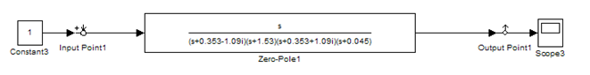
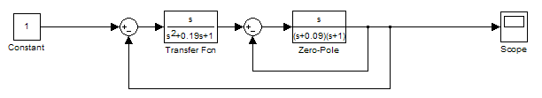
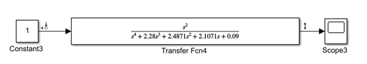
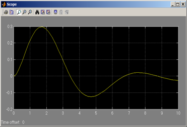
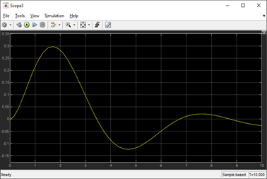
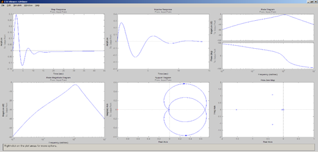
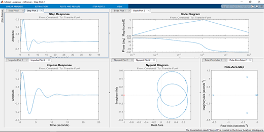

             
              Министерство образования Республики Беларусь
                          Учреждение образования 
            «Брестский государственный технический университет»
                            Кафедра ИИТ

                           Лабораторная работа №4 
                «Преобразование системы с сложной передаточной функцией»

	                                	Выполнил:
                                                студент 3 курса
                                                группы АС-56
                                                Мартынюк Р.С.

                                                Проверил:
                                                Пролиско Е.Е.

                                 Брест 2021

Цель работы: научиться преобразовывать системы с сложными передаточными функциями. 
 
Задание 3: Получим блок с передаточной функцией эквивалентной передаточной функции исходной системы;
 

Задание 4: Покажем, что все характеристики и показатели сохраняются.
Отличия структурных схем:
 

Отличие осциллографа переходной функции системы:
 

 
Отличие основных характеристик системы:
 

Все характерички и показатели практически совпадают.
Вывод: я научилися строить в Simulink модель системы с сложной структурой с использованием LTI-viewer.

 
