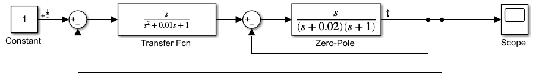
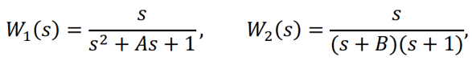
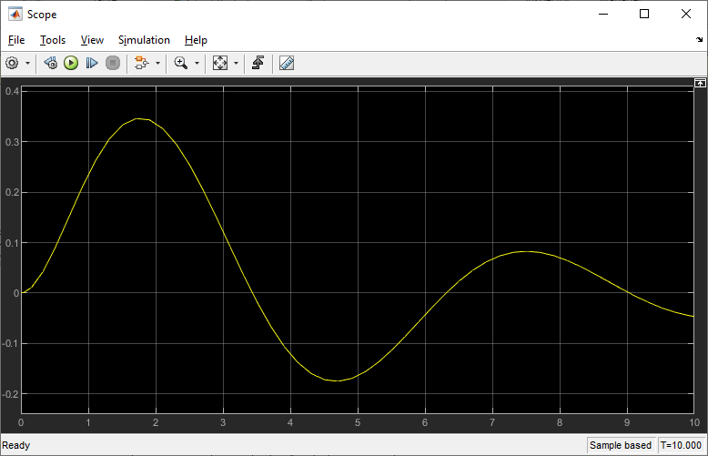
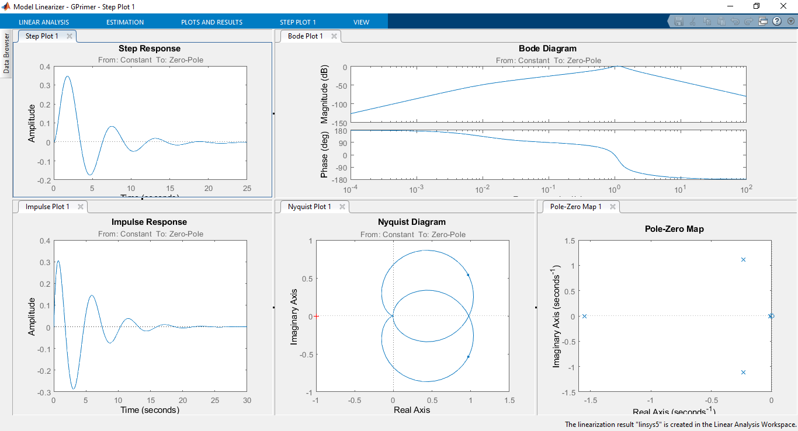

				
                                  МИНИСТЕРСТВО ОБРАЗОВАНИЯ РЕСПУБЛИКИ БЕЛАРУСЬ
                                            УЧРЕЖДЕНИЕ ОБРАЗОВАНИЯ 
                              «БРЕСТСКИЙ ГОСУДАРСТВЕННЫЙ ТЕХНИЧЕСКИЙ УНИВЕРСИТЕТ»
                                                КАФЕДРА ИИТ

                                            Лабораторная работа № 3
           По дисциплине: «Математические модели информационных процессов и управления»
                                              За 5 семестр
                             Тема: «Подключение основных настроек LTI-viewer»

                                                                            Выполнил:
                                                                            студент 3-го курса
                                                                            группы АС-56
                                                                            Хевук Д. А.

                                                                            Проверил:
                                                                            Пролиско Е. Е.

                                              Брест 2021

	Цель: 
		1) освоить основные операции используемые при исследовании моделей Simulink 
		с помощью LTI-viewer (построение передаточных функции и другие);
		2) построить модель и исследовать её с помощью LTI-viewer.

	Задание 1.
Подключим LTI-viewer к нашей системе. 
Выполним структурную схему, сверяясь с методологическими указаниями.
Структурная схема:

Передаточные функции блоков:

где А = номер дня рождения / 100; В = номер месяца рождения / 100 .
На осциллографе (Scope) получим переходную функцию системы:

	Задание 2.
Получим основные характеристики системы 
(передаточную функцию, импульсную характеристику, амплитудно-частотную и 
фазо-частотные характеристики, диаграмму Найквиста, значение нулей и полюсов);

	Вывод:
Мы изучили основные операции используемые при исследовании моделей Simulink с помощью 
LTI-viewer (построение передаточных функции и другие);
построили модель и исследовали её с с помощью LTI-viewer, получив необходимые графики.
